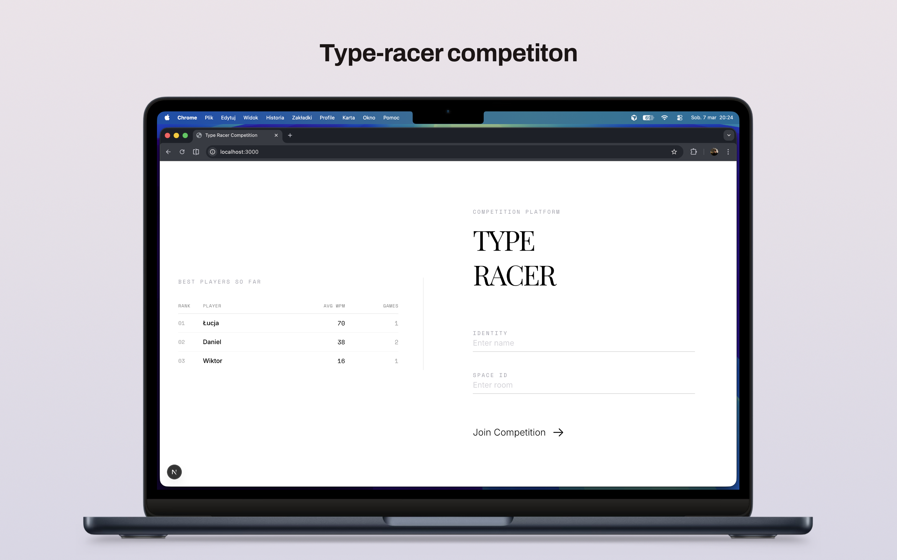

# TypeRacer Competition

## ⚡ Live Competition: Online Now

Test your typing speed against players in real-time. This full-stack application provides a seamless, competitive experience with live progress tracking and historical leaderboards.

### 🔗 Join the race: [type-racer-competition.vercel.app](https://type-racer-competition.vercel.app/)

> **Note:** The platform supports real-time multiplayer races, custom tournament rules, and persistent score tracking via Supabase.

---

A real-time multiplayer typing competition platform. Built with Next.js, Node.js, and Socket.IO for low-latency interaction and Supabase for persistent data storage.



## 🌟 Features

- **Real-time Multiplayer**: Compete with others simultaneously using Socket.IO
- **Live Progress Tracking**: See every competitor's progress in real-time with dynamic progress bars
- **Custom Tournaments**: Admins can configure round time, break duration, and total number of rounds
- **Historical Leaderboards**: Track your performance over time with Supabase-backed history
- **Responsive UI**: Modern, clean interface designed for maximum focus during races
- **Smart Metrics**: Track Words Per Minute (WPM) and accuracy with precision

## 🛠 Tech Stack

- **Frontend**: Next.js (React), Tailwind CSS
- **Backend**: Node.js, Socket.IO
- **Database**: Supabase (PostgreSQL)
- **Real-time**: WebSockets via Socket.IO
- **Deployment**: Vercel (Client), Node.js (Server)

## 🚀 Getting Started

1. **Clone & Install**:
   ```bash
   git clone <repo-url>
   npm install
   ```
2. **Database Setup**: Create a Supabase project and run the [schema.sql](server/supabase/schema.sql)
3. **Environment**: Configure your Supabase credentials in `server/.env`
4. **Run**:
   ```bash
   npm run dev
   ```

---
Detailed project breakdown can be found in the [Project Overview](docs/overview.md).