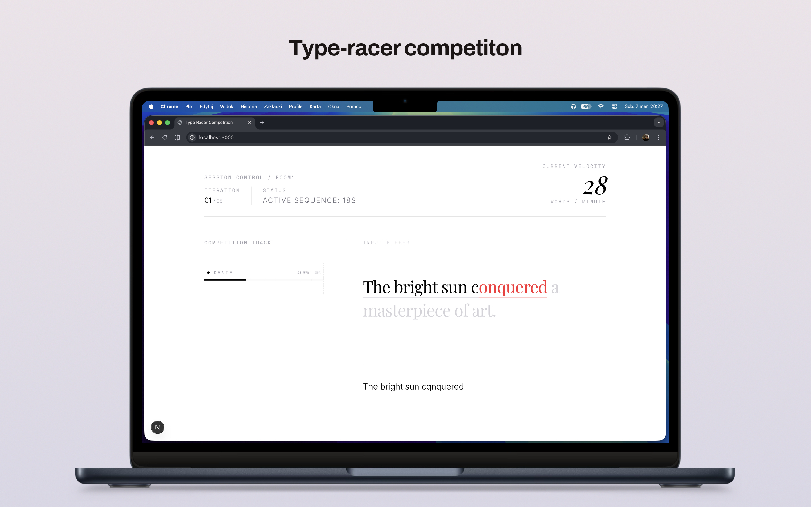

# Type Racer Competition

Step by step comments can be found [here](/docs/overview.md)

## Overview
This is a full-stack Type Racer competition app with a Next.js client and a Node.js server using Socket.IO and Supabase.

## Interface




## Prerequisites
- Node.js (v18 or newer recommended)
- npm (v9 or newer recommended)

## Installation
1. Clone the repository:
   ```bash
   git clone <repo-url>
   cd type-racer-competition
   ```
2. Install dependencies for both client and server:
   ```bash
   npm install
   ```
3. Create supabase project, and run [this](server/supabase/schema.sql) to create all necessary tables.

### Run app
```bash
npm run dev
```

- Starts the Next.js client on http://localhost:3000
- Starts the server (Socket.IO + Supabase) on http://localhost:4000 (or as configured)

## Environment Variables
- Configure Supabase and other secrets in `server/.env` as needed.

## Project Structure
- `client/` — Next.js frontend
- `server/` — Node.js backend (Socket.IO, Supabase)